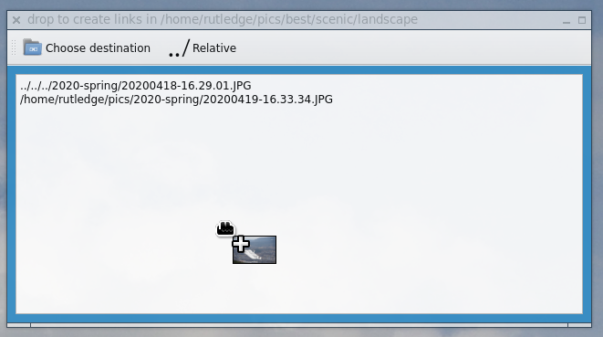

This is a drag-and-drop target for creating a symlinked subset out of a
collection of files by dragging from some other application into this window.

I use this for organizing pictures by category: open a by-date directory with
some DnD-capable [image gallery app](https://github.com/BestImageViewer/geeqie)
or file manager, open an instance of **droplinker** in a directory where I'd like
to create symlinks (for example my directory for bird pictures, or the
directory where I keep landscape pictures for use as desktop wallpaper), then I
can drag pictures into it to be symlinked.  With typical file managers you have
to hold down some modifier key (can you remember which one?) to create a link
instead of moving or copying; but droplinker only makes links.  It could be
used like that to make subsets of any collection or to make a different
directory structure pointing to pre-existing files: music or e-books that you
want to put on your phone, documents that you want to print from another
machine, etc.

You can of course open multiple instances of this program in different
directories if you are mass-organizing a lot of files in this way.

Another useful trick is to then use rsync -L to copy the actual files to
another machine, without making copies locally.

